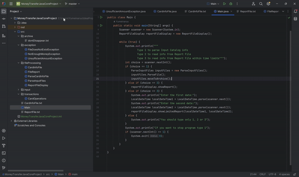
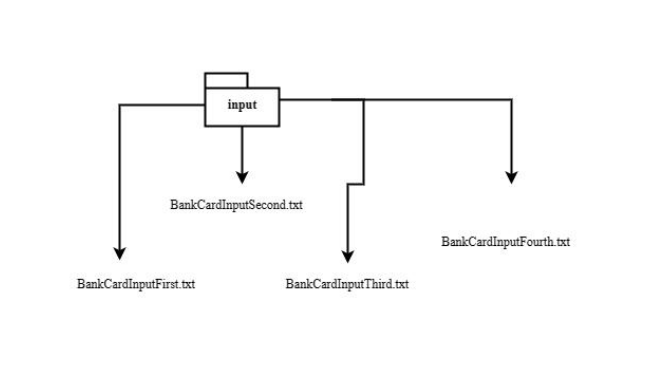
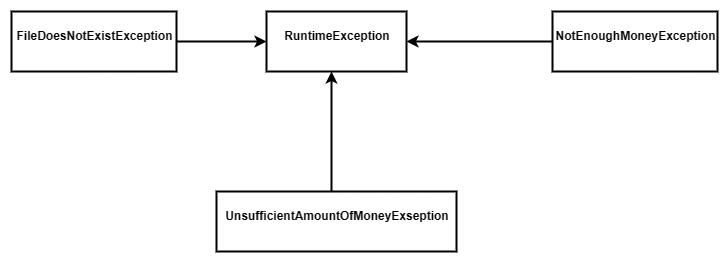

[](https://img.shields.io/badge/Released%20In-December-blue)   [](https://img.shields.io/badge/Made%20For-C71%20Group-blue)

My `Money Transfer Project` is the easiest way to securely and fast way to make your transactions



Developed for macOS, Windows and Linux.

**Usage**
---

```
Usage: Main.java [HAS 3 OPTIONS]

  Transfer your money fast and secure
  Developed by Lisavy Stanislau -> (Github: yumeinaruu)


Options:
  1          Parse Input Catalog info
  2          Read info from Report File
  3          Read info from Report File within time limits
```

**Installation Options**
---

1. Copy the repository in your Intelij Idea
2. Open Main.java class


**What's the project about?**
---

1. What You Need to Know Before Executing

    + Where accounts and their balance are located?
        - Beforehand, the program contains a file with account numbers and money amounts on them. 
    + Where transfer information is taken from?
        - From txt files in the "input" package.
    + What happens to files from "input" after?
        - They all refactor to "archive" package.
    + Where can I find a report about executed transactions? 
        - In ReportFile in src folder.



2. Technical Implementation Details

    + What is required from the user?
    	- At startup, the program waits for the following information to be entered:
1 is entered in the console - calling the operation of parsing translation files from input
2 is entered in the console - calling the operation to display the list of all transfers from report file 
3 is entered in the console - calling the operation to display the list of all transfers from report file within time limits typed by the user 
    + What if user tells makes tho program do something it's not supposed to?
        - The program has "exception" package, that contains classes, which were created to prevent program from doing unpredictable actions and fall.



3. More About Input And Report Files

    + What input files should contain?
        - Files should contain the following fields:
● account number, money are transferred from: (10 digits ХХХХХХ-ХХХХХ);
● account number, money are transferred to: (10 digits ХХХХХХ-ХХХХХ);
● Amount of money to be transferred (whole numbers only)
    + What output report file should contain?
        - The output report file should contain a list of processed operations with an indication of file, transaction status, date and time of the operation.
An example of an output report file:
● Date-Time | file_1 | Transfer from XXXXX-XXXXX to YYYYY-YYYYY 500 | successfully Processed
● Date-Time | file_1 | Transfer from XXXXX-XXXXX to YYYYY-YYYYY -100 | Error in Processing time, incorrect transfer amount

**How to Contribute**
---

1. Clone repo and create a new branch: `$ git checkout https://github.com/yumeinaruu/MoneyTransferJavaCoreProject -b name_for_new_branch`.
2. Make changes and test
3. Submit Pull Request with comprehensive description of changes

**Acknowledgements**
---

+ [Banner Maker](https://banner.godori.dev/) for logo.
+ [Diagram Maker](https://products.aspose.app/diagram/uml) for diagrams.
+ [TeachMeSkills courses](https://teachmeskills.by/) were extremly helpful while I was developing `Money Transfer Project`.

**Donations**
---

This is free, open-source software.
